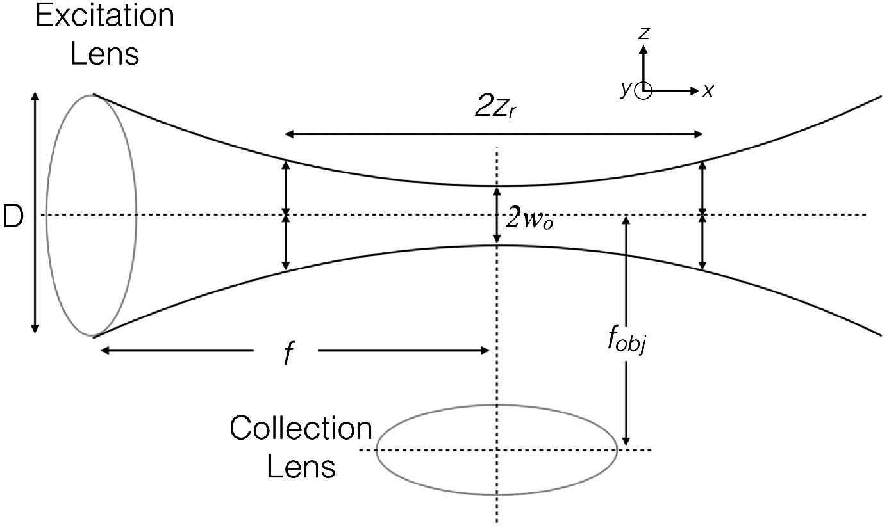
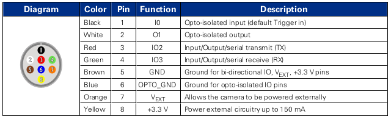
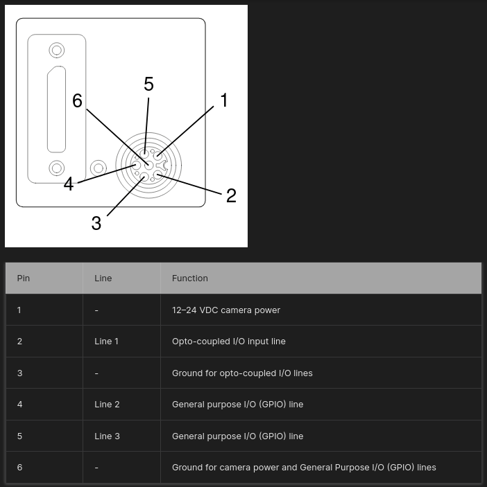

[](https://stand-with-ukraine.pp.ua)

Selective Plane Illumination Microscopy Setup for Volumetric Imaging
==================================

_Kyiv, Ukraine_

Setup based on open source projects.

# Design notes

> [!TIP]
> Read more about the SPIM principles: 
>
> - [Selective Plane Illumination Microscopy](https://link.springer.com/chapter/10.1007/978-0-387-45524-2_37)
> - [openSPIM project](https://openspim.org/)
> - [Selective plane illumination microscopy techniques in developmental biology](https://journals.biologists.com/dev/article/136/12/1963/65234/Selective-plane-illumination-microscopy-techniques)
> - [Using tissue clearing and light sheet fluorescence microscopy for the three-dimensional analysis of sensory and sympathetic nerve endings that innervate bone and dental tissue of mice](https://onlinelibrary.wiley.com/doi/full/10.1002/cne.25582)

## Gaussian litgh-sheet
_Based on [Olarte et al., 2018](https://opg.optica.org/aop/fulltext.cfm?uri=aop-10-1-111&id=381035) and [Power and  Huisken, 2017](https://whttps://opg.optica.org/aop/fulltext.cfm?uri=aop-10-1-111&id=381035ww.nature.com/articles/nmeth.4224)._

__Schematic of the illumination and detection arm in a SPIM__ (_Olarte et al., 2018_)
<p align="center">
</a>
</p>


### Illumination arm
Light-sheet thickness (axial sectioning resolution): 

```math
l_z = 2w_0 = 2 \frac{n \cdot \lambda_{ex.}}{\pi \cdot NA_{ex.}}
```

Light-sheet length (field of view/FOV):

```math
l_x = 2z_r = 2 \frac{\pi \cdot w_0^2}{\lambda_{ex.}} = 2 \frac{n^2 \cdot \lambda_{ex.}}{\pi \cdot NA_{ex.}^2}
```


### Detection arm
Lateral resolution (Rayleigh criterion):

```math
d_{xy} = \frac{0.61 \cdot \lambda_{det.}}{NA_{det.}}
```

Axial resolution (depth of field/DOF):

```math
d_z = \frac{n \cdot \lambda_{det.}}{NA_{det.}^2}
```

## Illumination light path parameters

# Samples and desired characteristics

__NB: is 10x NA 0.25 FN 22 enough?__

## Sciatic nerve
- Nerve diameter: 1.5-2 mm
- Nerve length: 5-20 mm
- A-fiber diameter: 1.5 - 10 um 
- C-fiber diameter: 0.5 - 2 um
- Minimal vessel diameter

## Scaffolds
_In progress_


# Hardware
- ESP32 with [Arduino32bitBoards device adapter](https://github.com/bonnom/Arduino32BitBoards/tree/master?tab=readme-ov-file)
- OXLaser 505 nm, 520 nm, and 650 nm
- Basler Ace 2R Pro

## Objectives

| Model                           | Olympus PlaN | Olympus UPlanFl Ph. 1 |
| ------------------------------- | ------------ | --------------------- |
| Magnification (M)               | 10x          | 10x                   |
| Numerical aperture (NA)         | 0.25         | 0.3                   |
| Working distance (WD)           | 10.6 mm      | 10 mm                 |
| Focal distance (F)              | 18 mm        | 18 mm                 |
| Back focal plane distance (BFP) | N/A          | -19.1 mm              |
| Field number (FN)               | 22           | 26.5 mm               |
| Lateral resolution              | 1.34 μm      | 1.12 μm               |
| Parafocal distance (PD)         | 45 mm        | 65 mm                 |
| Exit pupil diameter (EP)        | 9 mm         | 10.8 mm               |

## Cameras

| Model           | FLIR Grasshopper 3     | Basler Ace 2R       |
| --------------- | ---------------------- | -------------------- |
| ID              | GS3-U3-23S6M-C         | a2A5320-23umPRO      |
| Sensor          | Sony IMX174 (CMOS)     | Sony IMX542 (CMOS)   |
| Sensor size     | 11.25x7.03 mm (1/1.2") | 14.58x8.31 mm (1.1") |
| Sensor diagonal | 13.4 mm                | 16.78 mm             |
| Pixels (HxV)    | 1920x1200 (2.3 Mpx)    | 5320x3032 (16.1 Mpx) |
| Pixel size      | 5.86x5.85 μm           | 2.74x2.74 μm         |
| Frame rate      | up to 162 fps          | up to 24 fps         |

__FLIR Grasshopper 3 GPIO pinout__
<p align="center">
</a>
</p>

__Basler Ace 2R  GPIO pinout__
<p align="center">
</a>
</p>

# Software
All control is provided with [Micro-Manager](https://micro-manager.org/) and [pymmcore-plus](https://pymmcore-plus.github.io/pymmcore-plus/) library with [napari-micromanager](https://pymmcore-plus.github.io/napari-micromanager/) GUI.

__Configuration__
|Component | Desctiption | Micro-manager adapter| Port (laptop) | Note |
|- | - | - | - | - |
|Camera | FLIR Grasshopper3 USB3 | [Point Grey Research](https://micro-manager.org/Point_Grey_Research)| USB 3.0 (COM7) | |
|Stage | Sutter Instruments MPC-200 | [CustomArduino](https://micro-manager.org/CustomArduino) (MarzhauserLStep Z-stage)| |  |
|Lasers | Laser control wtih TTL | [Arduino](https://micro-manager.org/Arduino)| COM6 | Change ArduMM version in sketch to 2 |

# License 
This open-source project is released under the CERN Open Hardware License. Our aims are to promote open scientific hardware development and to share our engineering solutions.