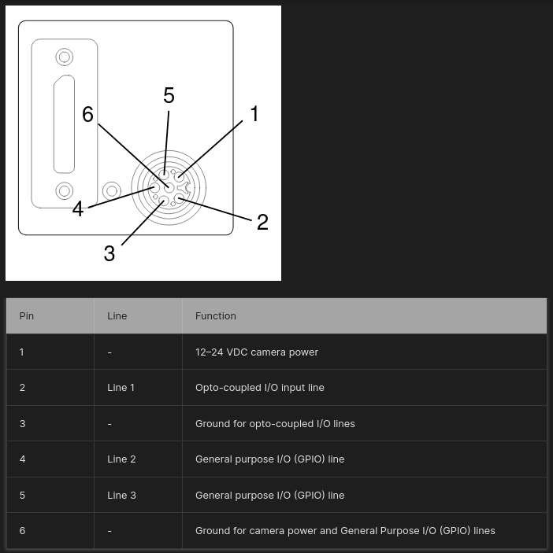

Selective Plane Illumination Microscopy Setup for Volumetric Imaging
==================================

_Kyiv, Ukraine_

L-SPIM setup, version 0.0

# Detection arm

## Detection params
| Parameter                                              | Value                               |
| ------------------------------------------------------ | ----------------------------------- |
| Detection objective                                    | Olympus PlaN 10x 0.25 FN 22 (F18)   |
| Detection tube lens                                    | F100                                |
| Magnification                                          | ~5.56x                              |
| Camera                                                 | Basler Ace 2R Pro (a2A5320-23umPRO) |
| Pixel size                                             | 0.493 μm/px                         |
| Field of view                                          | 2.62x1.49 mm                        |
| Theoretical resolution (500 nm)                        | 1.220 μm                            |
| Theoretical depth of field (500 nm, n=1.33)            | 10.640 μm                           |
| Z-stack step (Sutter Instruments MPC-200 with MP225/M) | 0.0625 μm/μstep (16 μstep/μm)       |

## Filters

# Excitation arm
## Light path

## Lasers

# Control software
## Micromanager configuration

## Camera
| Model           | Basler Ace 2R        |
| --------------- | -------------------- |
| ID              | a2A5320-23umPRO      |
| Sensor          | Sony IMX542 (CMOS)   |
| Sensor size     | 14.58x8.31 mm (1.1") |
| Sensor diagonal | 16.78 mm             |
| Pixels (HxV)    | 5320x3032 (16.1 Mpx) |
| Pixel size      | 2.74x2.74 μm         |
| Frame rate      | up to 24 fps         |

__Basler Ace 2R  GPIO pinout__

</a>

## Sync

Synchronisation with [Arduino32bitBoards](https://micro-manager.org/Arduino32bitBoards), specs for ESP32:

- Baudrate: 115200
- DAC1 on pin 25 and DAC2 on pin 26
- ADC not implemented
- Able to set PWM frequency and Resolution
- Low Price boards available
- KEEP IN MIND: NOT 5V TOLERANT!!

__Pinout:__
- Trigger: Pin 5
- Channel 1: Pin 25 (DAC)
- Channel 2: Pin 26 (DAC)
-  Channel 3: Pin 27 (PWM)
- Channel 4: Pin 15 (PWM)
- Channel 5: Pin 14 (PWM)
- Channel 6: Pin 4 (PWM)
- Channel 7: Pin 23 (PWM)
- Channel 8: Pin 19 (PWM)

## Hardware config

# License 
This open-source project is released under the CERN Open Hardware License. Our aims are to promote open scientific hardware development and to share our engineering solutions.